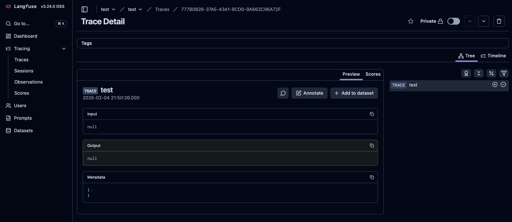

# Langfuse v3 with AWS CDK

This project helps you build and deploy [Langfuse v3](https://langfuse.com/changelog/2024-12-09-Langfuse-v3-stable-release) using AWS CDK.

## Architecture


* Deploys Langfuse Web/Worker Services and ClickHouse using ECS on Fargate
  * Enables service-to-service communication through ECS Service Connect
  * Utilizes EFS for ClickHouse storage
* Implements Aurora Serverless V2 for the relational database
* Uses ElastiCache Valkey for caching and queue management
* Employs S3 for blob storage

## Set Up Your Environment

Ensure you have Node.js, npm, and the AWS CDK CLI installed.

## Usage

### 1. **Set Configuration Properties**
Please modify the following configuration files:
   * [`/bin/app-config.ts`](/bin/app-config.ts): Environment parameters (including AWS Account ID, Region, and Domain).
   * [`/lib/stack-config.ts`](/lib/stack-config.ts):  Parameters for AWS Resources and Langfuse Services.

### 2. **Deploy**
Run the following commands to deploy your stack:

```sh
npm ci
npx cdk deploy --context env=dev
```

Deployment takes approximately 20 minutes.
Upon completion, you'll receive the Langfuse App URL in the output:

```sh
Outputs:
# omit

LangfuseWithAwsCdkStack-prod.LangfuseURL = https://langfuse.example.com

# omit
✨  Total time: 1040.53s
```

You can now start using your Langfuse application!

### 3. **Clean Up**
If you no longer need the resources, destroy the stack with:

```sh
npx cdk destroy --context env=dev
```

## Example: Testing the Langfuse Application via REST API

After building your application, you can perform operational checks using REST API calls.
This section provides a step-by-step guide to testing your app.

### Reference
For detailed API documentation, please refer to the [API Reference](https://api.reference.langfuse.com/#tag/comments).

### Setting Up Environment Variables

Before making API calls, you need to set your hostname and API keys. Replace the placeholders with your actual Langfuse URL, Public Key, and Private Key.

```sh
export LANGFUSE_HOST="YOUR_LANGFUSE_URL"
export LANGFUSE_PUBLIC_KEY="YOUR_PUBLIC_KEY"
export LANGFUSE_PRIVATE_KEY="YOUR_PRIVATE_KEY"
```

### Performing a Health Check

You can perform a health check using the following curl command:

```sh
curl "$LANGFUSE_HOST/api/public/health" \
  --header "Authorization: $LANGFUSE_PUBLIC_KEY:$LANGFUSE_PRIVATE_KEY"
```

#### Expected Result
A successful health check will return a response similar to this:

```json
{
  "status": "OK",
  "version": "3.24.0"
}
```

### Ingestion Test

To test the ingestion, use the following curl command.
This example demonstrates how to send a trace creation request.

```sh
curl -X POST "$LANGFUSE_HOST/api/public/ingestion" \
  -u "$LANGFUSE_PUBLIC_KEY:$LANGFUSE_PRIVATE_KEY" \
  -H "Content-Type: application/json" \
  -d '{
    "batch": [
      {
        "type": "trace-create",
        "id": "'$(uuidgen)'",
        "timestamp": "'$(date -u +"%Y-%m-%dT%H:%M:%S.000Z")'",
        "metadata": null,
        "body": {
          "id": "'$(uuidgen)'",
          "name": "test",
          "timestamp": "'$(date -u +"%Y-%m-%dT%H:%M:%S.000Z")'",
          "public": false
        }
      }
    ],
    "metadata": null
  }'
```

#### Expected Result
A successful ingestion will return a response like this:

```json
{
  "successes": [
    {
      "id": "523EFC5E-8BAC-485D-9CC3-C049B5F64FA4",
      "status": 201
    }
  ],
  "errors": []
}
```

It is acceptable as long as the result can be viewed from the frontend as well, as shown below.

